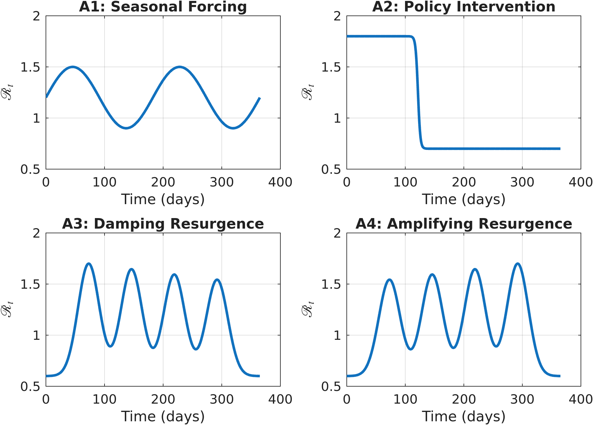
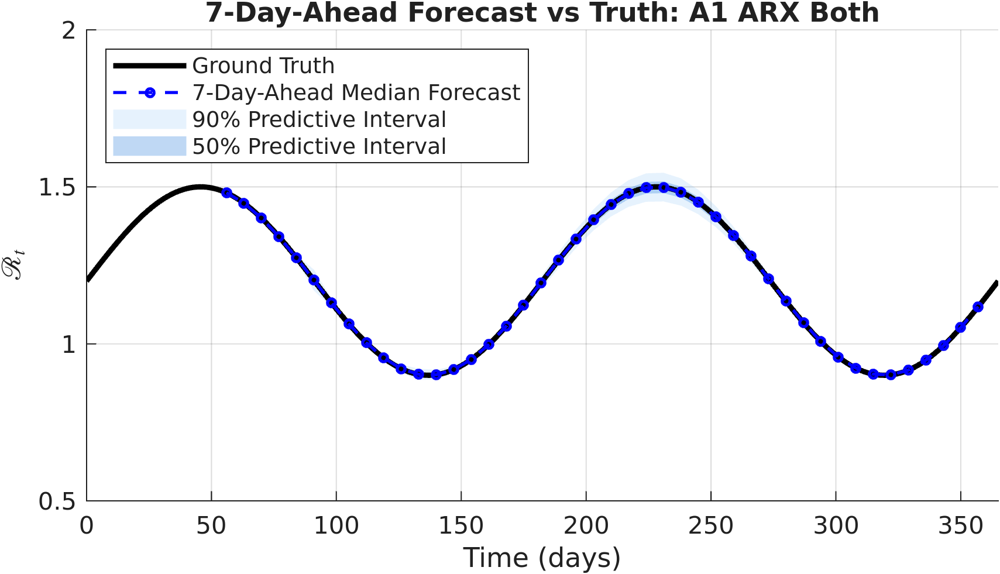
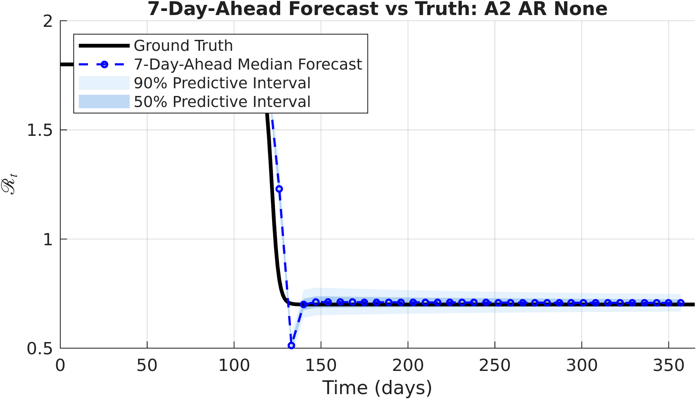
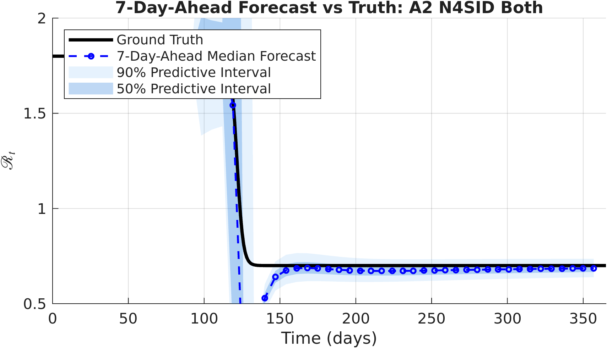
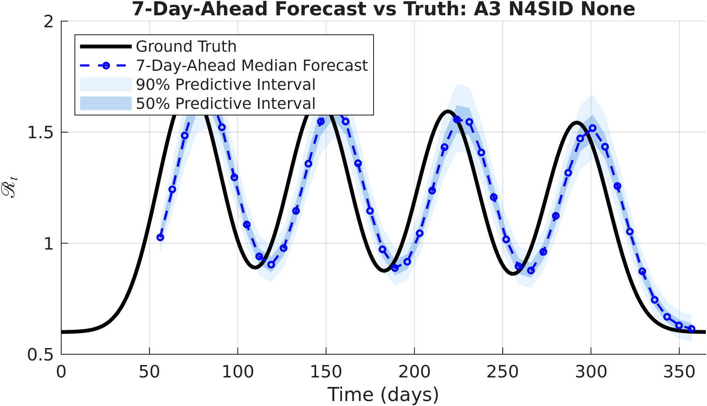
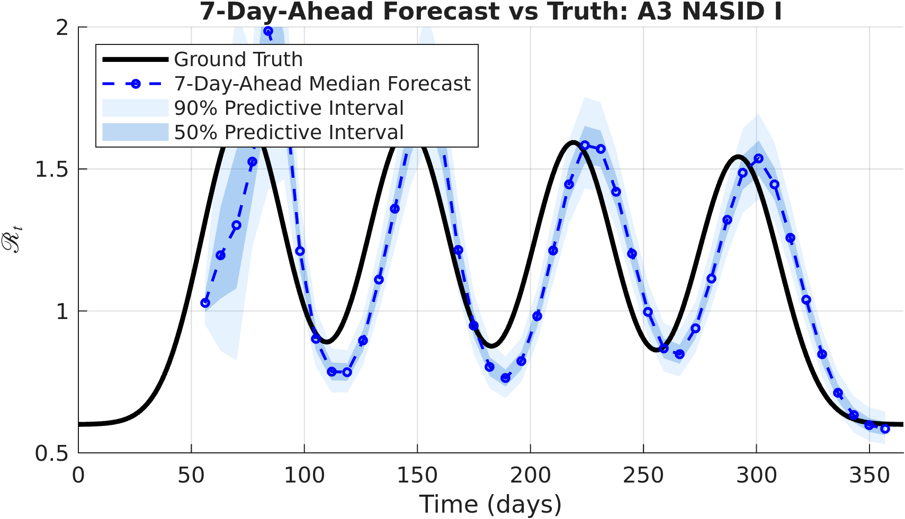
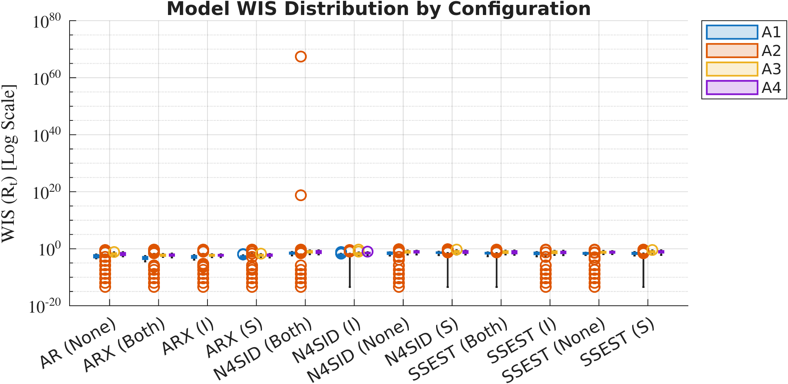

# Hybrid Epidemic Forecasting
## Part A Implementation
### February 2026

---

Abdirahman Mohamed
1TE864 Degree Project in Engineering Physics
Uppsala University

---

## 1. Introduction

### 1.1 Background

In epidemic forecasting, mechanistic compartment models (such as SIR/SIRS) often struggle to
accurately predict the effective reproduction number (Rt). Because Rt is a hidden parameter that
changes over time, we have to estimate it from noisy case counts. Relying on just data-driven
methods (such as time-series models) or just mechanistic models usually leads to poor
predictions. In this project, we investigate a hybrid forecasting framework. We combine
mechanistic models with statistical time-series inference to better capture how Rt changes over
time.

### 1.2 Objective

The objective of this initial phase is to establish a controlled synthetic baseline for
evaluating the forecasting framework. Instead of using empirical data, analytically constructed
Rt trajectories are defined and treated as known transmission signals.

Because the true evolution of these trajectories is fully specified, forecast performance can be
assessed directly against the underlying transmission process.

By working under these controlled conditions, this phase isolates the statistical forecasting
component from uncertainties related to data estimation or observational noise. The purpose is
therefore to determine the theoretical performance limits of the framework before introducing
additional sources of complexity in later stages of the project.

---

## 2. Methods

The evaluation proceeds in five stages. Synthetic Rt trajectories are first defined analytically
and SIRS state trajectories are simulated deterministically (Sections 2.1 and 2.2). A global
hyperparameter selection pass then evaluates all candidate model configurations jointly across
all scenarios using the Weighted Interval Score. The selected configurations are subsequently
applied in an expanding-window forecast procedure, and the resulting forecasts are aggregated
and scored (Sections 2.3 and 2.4).

### 2.1 Synthetic Transmission Scenarios

To evaluate the forecasting framework under controlled conditions, four synthetic Rt scenarios
were defined using analytic functions. Each trajectory spans a 365-day timeline and represents a
distinct transmission pattern while remaining within realistic bounds, approximately 0.5 and
2.0. These predefined Rt curves serve as the ground-truth transmission signals throughout this
phase of the study.

The following transmission patterns were constructed:

- **Seasonal Forcing (A1):** A sinusoidal Rt profile that produces periodic epidemic waves over
  time. The trajectory oscillates about a centre value of 1.2 with amplitude 0.3 and a period
  of 182.5 days.

- **Policy Intervention (A2):** A sigmoid-based transition representing a gradual change in
  Rt, analogous to the implementation of public health measures such as lockdowns or mobility
  restrictions. Rt decreases from 1.8 to 0.7 over a transition centred at day 121.7.

- **Damping Resurgence (A3):** A multi-wave Gaussian construction in which each successive
  peak decreases in magnitude, representing a gradually weakening outbreak. Four peaks are
  evenly spaced at 73-day intervals above a baseline of 0.6.

- **Amplifying Resurgence (A4):** A multi-wave Gaussian construction in which each successive
  peak increases in magnitude, representing a progressively intensifying outbreak. The peak
  structure mirrors A3 but with amplitudes increasing across the four waves.

The four trajectories are shown in Figure 1.

**Figure 1.** The four synthetic ground-truth Rt trajectories used as transmission signals
throughout this phase. Each panel spans 365 days. A1 (top left) follows a smooth sinusoidal
pattern. A2 (top right) undergoes an abrupt sigmoid transition from high to low transmission.
A3 (bottom left) and A4 (bottom right) exhibit four-wave Gaussian structures with decreasing
and increasing peak amplitudes, respectively. All trajectories remain within the admissibility
bounds [0.5, 2.0].

In addition to the transmission trajectories, mechanistic state variables were generated using
the deterministic solver of the SIRS model within the URDME framework. The SIRS model was
parameterised with a recovery rate γ = 1/7 day⁻¹, an immunity loss rate ξ = 1/90 day⁻¹, and a
population of N = 100,000. Given the predefined Rt signal, the solver produces consistent
Susceptible (S) and Infected (I) state trajectories. These states are later used as exogenous
inputs in the hybrid model configurations. The deterministic solver ensures that the state
trajectories remain free from stochastic variability, allowing this phase to isolate the
forecasting component under idealised conditions.

### 2.2 Statistical Forecasting Models

To forecast the synthetic Rt trajectory defined in Section 2.1, four families of statistical
time-series models were applied to its historical values. All models operate on the
log-transformed Rt series, fitting to y(t) = log(Rt(t)) for numerical stability, and
exponentiate their outputs to return forecasts in natural scale. If a model fails during
estimation or produces a non-finite output, a persistence forecast is substituted: a constant
prediction equal to the last observed Rt value, with zero-width predictive intervals at all
coverage levels.

The models evaluated in this phase are:

**AR** — A pure autoregressive model that serves as the statistical baseline. It uses only past
values of the synthetic Rt trajectory to generate forecasts of future Rt values. The
autoregressive lag order p is the sole hyperparameter, searched over the grid p ∈ {0, 1, ...,
14}. The model is estimated using Burg's method via MATLAB's System Identification Toolbox.
The selected global hyperparameter is p = 2.

**ARX** — An autoregressive model with exogenous inputs. In addition to historical Rt values,
mechanistic state variables are incorporated as external covariates. The parameters are the
autoregressive order na, exogenous memory order nb, and exogenous input delay nk, searched over
the joint grid na ∈ {0, ..., 14} × nb ∈ {1, ..., 7} × nk ∈ {1, ..., 7}, giving 735 candidates.
Three covariate configurations are considered: using the Susceptible compartment alone (ARX/S),
the Infected compartment alone (ARX/I), and both compartments jointly (ARX/Both). The model is
estimated using MATLAB's `arx` function. All three ARX configurations select the same
hyperparameters globally: na = 4, nb = 1, nk = 1.

**N4SID** — A state-space model estimated using Subspace State-Space System Identification. The
N4SID algorithm constructs a discrete-time linear state-space system by decomposing a block
Hankel matrix of input-output data via singular value decomposition. The model order n (number
of internal states) is the sole hyperparameter, searched over n ∈ {1, ..., 8}. N4SID is applied
in the same four exogenous configurations as ARX: without exogenous inputs (N4SID/None), with
the Susceptible compartment (N4SID/S), the Infected compartment (N4SID/I), and both
(N4SID/Both). Selected global hyperparameters are n = 1 (None), n = 2 (S), n = 2 (I), and
n = 2 (Both).

**SSEST** — A state-space model estimated using iterative Prediction Error Minimisation (PEM)
via MATLAB's `ssest` function. The model structure is the same discrete-time state-space form
as N4SID, but the parameter estimates are obtained by minimising the one-step-ahead prediction
error through gradient-based optimisation rather than a one-shot subspace decomposition. The
same hyperparameter grid (n ∈ {1, ..., 8}) and the same four exogenous configurations apply.
Selected global hyperparameters are n = 1 (None), n = 3 (S), n = 3 (I), and n = 2 (Both).

All four model families produce probabilistic forecasts. At each window, the model returns a
median forecast and four pairs of symmetric predictive interval bounds at coverage levels
(1 − α) for α ∈ {0.05, 0.10, 0.20, 0.50}, corresponding to 95%, 90%, 80%, and 50% predictive
intervals respectively. The interval bounds are constructed analytically in log-space. Given the
forecast mean pred_y and standard deviation pred_sd from the fitted model, the bounds at level
α are

> lower_α = exp(pred_y − z_α · pred_sd),
> upper_α = exp(pred_y + z_α · pred_sd),

where z_α = √2 · erfinv(1 − α). Exponentiating the bounds guarantees that the predictive
intervals respect the positivity of Rt.

When ARX, N4SID, or SSEST are used, forecasting over a 14-day horizon requires future values of
the exogenous compartments. These are obtained by running the SIRS deterministic solver forward
from the current state under a flat-beta assumption: the transmission rate is held constant at
β = γ · Rt(t) over the forecast horizon, where Rt(t) is the last observed value. This produces a
physically consistent projection of the S and I trajectories without requiring knowledge of
future Rt. Both historical and projected compartment values are scaled by the population size
before being passed to the model as covariates.

### 2.3 Expanding-Window Validation

Forecast performance was evaluated using an expanding-window validation strategy that reflects
sequential data availability. The procedure begins with an initial training window of 49 days of
historical synthetic Rt values. Based on this window, model parameters are estimated and a
14-day forecast of Rt is generated. After each forecast is recorded, the window endpoint is
advanced by 7 days. The model is retrained using the expanded set of historical Rt observations,
and a new 14-day forecast is produced. This process continues across the 365-day synthetic
timeline until the remaining data length equals the forecast horizon, yielding 44 expanding
windows per scenario.

The validation procedure is organised into two sequential phases. In the first phase, a global
hyperparameter selection pass scores every candidate configuration for a given model family and
exogenous mode across all four scenarios simultaneously. For each candidate, the mean Weighted
Interval Score (WIS) is computed over every expanding window in every scenario; the four
per-scenario means are then averaged equally to give a single global score. The candidate with
the minimum global mean WIS is selected and fixed. In the second phase, the selected fixed
configuration is applied in the expanding-window forecast procedure across all four scenarios,
producing the forecast trajectories that are subsequently evaluated.

This two-phase design separates hyperparameter selection from forecast evaluation. Because the
same candidate configurations are scored uniformly across all scenarios, the global selection
criterion avoids overfitting to any individual transmission pattern.

### 2.4 Forecast Evaluation and Numerical Safeguards

Forecast accuracy was quantified using the Weighted Interval Score (WIS), a proper scoring rule
for probabilistic forecasts represented as a central estimate and a set of predictive intervals.
WIS rewards both accuracy and calibration: a forecast scores well when the median is close to
the truth and when the predictive intervals are both sharp and cover the truth at the stated
rates.

Given an observed value y, a median forecast m̂, and K = 4 predictive intervals each defined by
lower bound l_k, upper bound u_k, and miscoverage rate α_k ∈ {0.05, 0.10, 0.20, 0.50}, the WIS
for a single forecast step is

> WIS = 1/(K + 1/2) · [½ |y − m̂| + Σ_{k=1}^{K} (α_k/2) · IS_k]

where the interval score IS_k is

> IS_k = (u_k − l_k) + (2/α_k) max(l_k − y, 0) + (2/α_k) max(y − u_k, 0).

The three terms within IS_k penalise interval width (sharpness), left-side undercoverage, and
right-side undercoverage respectively, with the undercoverage penalty increasing as α_k decreases
(tighter nominal intervals carry higher penalties for missed coverage). The denominator K + 1/2 =
4.5 normalises the score to remain comparable in magnitude to the absolute forecast error.

WIS was computed pointwise for each of the 14 forecast horizon steps and averaged over the
horizon to give a per-window score. Reported summary statistics are the mean of this per-window
WIS across all 44 windows within each scenario.

To ensure numerical stability during parameter estimation, the historical Rt training data was
log-transformed prior to model fitting. Forecasts were subsequently exponentiated to return
values in the original scale. If a model returned a forecast with insufficient signal (standard
deviation of log Rt below 1e-8), produced non-finite outputs, or raised an exception during
fitting, a persistence forecast was substituted and the window WIS was set to infinity. This
prevented degenerate configurations from contributing valid scores during the global selection
pass.

---

## 3. Results

### 3.1 Qualitative Forecast Dynamics

Forecast performance varies systematically with the structural characteristics of the underlying
transmission pattern. In scenarios characterised by smooth and continuously evolving dynamics,
the AR and ARX families track the synthetic Rt trajectory with stable forecasts across expanding
windows. Figure 2 illustrates this for ARX/Both on the seasonal scenario (A1): the median
forecasts follow the sinusoidal ground truth closely throughout the full 365-day timeline, with
the 90% predictive intervals remaining narrow and well-calibrated. The 50% intervals are nearly
invisible at this scale, indicating a high degree of forecast precision under smooth periodic
dynamics.

**Figure 2.** Expanding-window forecasts for ARX/Both on Scenario A1 (Seasonal Forcing). The
solid black line is the ground-truth Rt trajectory. Dashed blue lines are the 14-day median
forecasts from each expanding window, and the shaded regions show the 90% (light blue) and 50%
(medium blue) predictive intervals. The forecasts track the sinusoidal ground truth closely
throughout, with narrow predictive intervals that remain well-calibrated. This configuration
achieves the lowest mean WIS of any combination in the evaluation (0.00095 on A1).

In Scenario A2 (Policy Intervention), the abrupt sigmoid transition poses the greatest
difficulty across all model families. Forecasts generated before the structural change cannot
anticipate the new transmission level, because the models are trained only on the earlier regime.
The result is a systematic lag: predictions remain close to the prior level and adjust only after
enough post-transition observations accumulate in the expanding training window. Figure 3 shows
this behaviour for AR/None on A2: the forecast medians remain near Rt ≈ 1.8 until the transition
enters the training window, at which point they rapidly converge toward the post-intervention
level. The predictive intervals widen noticeably in windows that straddle the transition,
reflecting the model's increased uncertainty during regime change.

**Figure 3.** Expanding-window forecasts for AR/None on Scenario A2 (Policy Intervention).
Notation as in Figure 2. The forecasts show a clear lag at the sigmoid transition around day
120: forecasts generated before the transition cannot anticipate the drop in Rt, and the
predictive intervals widen substantially in windows spanning the structural break. After the
transition, the forecasts track the lower steady-state level closely. AR/None achieves the
lowest mean WIS on this scenario (0.024) of any model configuration evaluated.

Notably, ARX and state-space models with exogenous inputs show increased forecast variability
around the transition compared to the AR baseline. This occurs because the SIRS compartment
trajectories also shift rapidly during the intervention, causing the exogenous covariates to
encode the transition dynamics rather than predictive information about future Rt. In this
setting, the additional covariates become a source of confounding rather than signal.

This confounding is most severe for N4SID/Both. Figure 4 shows the corresponding forecast
overlay on A2: the predictive intervals expand dramatically around the transition, dwarfing the
scale of the ground-truth Rt values, and the median forecasts become erratic. This reflects an
ill-conditioned subspace identification when the training data contain a rapid regime shift
combined with multiple exogenous inputs. The mean WIS for this configuration on A2 is
approximately 5.1 × 10⁶⁵ — a catastrophic numerical failure driven by a small number of
windows in which the identified system becomes unstable.

**Figure 4.** Expanding-window forecasts for N4SID/Both on Scenario A2 (Policy Intervention).
Notation as in Figure 2. Around the sigmoid transition, the predictive intervals expand
catastrophically and the median forecasts become highly erratic, illustrating the numerical
instability of the subspace identification algorithm under rapid regime change with multiple
exogenous inputs. This configuration produces a mean WIS of approximately 5.1 × 10⁶⁵ on A2.
The equivalent SSEST/Both configuration remains numerically stable throughout.

Among the state-space models, the value of the Infected compartment as an exogenous input is
most clearly visible on the multi-wave scenarios. Figures 5a and 5b compare N4SID/None and
N4SID/I on Scenario A3 (Damping Resurgence). Without exogenous inputs (Figure 5a), the
forecasts respond to each peak after it has begun to emerge in the training window, but the
median trajectories diverge noticeably from the ground truth on the descending flanks of each
wave and tend to overestimate the local level between peaks. With the Infected compartment
included (Figure 5b), the forecast medians follow the multi-wave structure more faithfully, with
narrower predictive intervals and better-calibrated coverage throughout the mid-wave and
inter-wave phases.

**Figure 5a.** Expanding-window forecasts for N4SID/None on Scenario A3 (Damping Resurgence).
Notation as in Figure 2. Without exogenous inputs, the order-1 state-space model produces wide
predictive intervals and struggles to track the declining amplitudes of successive peaks,
consistently overestimating Rt between waves. Mean WIS on A3: 0.102.

**Figure 5b.** Expanding-window forecasts for N4SID/I on Scenario A3 (Damping Resurgence).
Notation as in Figure 2. Including the Infected compartment as an exogenous input substantially
improves tracking of the multi-wave structure. The forecast medians follow the ground truth more
closely across all four peaks, and the predictive intervals are narrower throughout. Mean WIS on
A3: 0.032 — a threefold improvement over N4SID/None.

### 3.2 Quantitative Performance Evaluation

Forecast accuracy was assessed using the mean WIS per expanding window, averaged over all 44
windows within each scenario. Figure 6 shows the distribution of per-window WIS values for all
twelve model-exogenous combinations across the four scenarios on a logarithmic scale. The ARX
configurations cluster at the low end of the WIS range with compact distributions, while the
state-space configurations exhibit both higher central WIS values and wider dispersion. The
N4SID/Both configuration on A2 produces a single extreme outlier that sits far above all other
observations, visible as an isolated circle at the top of the N4SID/Both column.

**Figure 6.** Distribution of per-window mean WIS values for all twelve model-exogenous
configurations, shown on a logarithmic scale. Each point represents one expanding window; colour
indicates scenario (A1: blue, A2: orange, A3: grey, A4: purple). The isolated circle at the top
of the N4SID/Both column corresponds to the numerical blow-up on Scenario A2 (WIS ≈ 5.1 × 10⁶⁵).
Lower WIS is better. The ARX configurations and AR/None occupy the lowest-WIS region of the
plot; state-space configurations show both higher central values and greater spread.

Table 1 reports the mean WIS for all twelve combinations across the four scenarios.

**Table 1. Mean WIS per scenario and overall.** Values are the mean of the per-window WIS
across 44 expanding windows. The global mean is the unweighted average across the four scenario
means. N4SID/Both is excluded from ranking because its global mean is dominated by the numerical
blow-up on A2 (mean WIS ≈ 5.1 × 10⁶⁵); per-scenario values for the remaining three scenarios
are listed for completeness.

| Model  | Exo  | A1 (Seasonal) | A2 (Intervention) | A3 (Damping) | A4 (Amplifying) | Global mean |
|--------|------|---------------|-------------------|--------------|-----------------|-------------|
| ARX    | I    | 0.00217       | 0.04295           | 0.00569      | 0.00589         | 0.01418     |
| ARX    | S    | 0.00201       | 0.04256           | 0.00636      | 0.00625         | 0.01430     |
| ARX    | Both | 0.00095       | 0.04377           | 0.00647      | 0.00684         | 0.01451     |
| AR     | None | 0.00396       | 0.02442           | 0.02012      | 0.02123         | 0.01743     |
| N4SID  | I    | 0.01129       | 0.03166           | 0.03194      | 0.03422         | 0.02728     |
| SSEST  | None | 0.02632       | 0.03410           | 0.06794      | 0.07114         | 0.04988     |
| SSEST  | I    | 0.03330       | 0.02961           | 0.08225      | 0.07337         | 0.05463     |
| SSEST  | Both | 0.03113       | 0.03528           | 0.09493      | 0.09006         | 0.06285     |
| N4SID  | None | 0.03491       | 0.03333           | 0.10204      | 0.10566         | 0.06899     |
| SSEST  | S    | 0.02948       | 0.03550           | 0.11888      | 0.11350         | 0.07434     |
| N4SID  | S    | 0.04468       | 0.04371           | 0.14407      | 0.10265         | 0.08378     |
| N4SID  | Both | 0.03503       | ≈ 5.1 × 10⁶⁵ ‡   | 0.11278      | 0.10319         | —           |

‡ Catastrophic numerical blow-up; see Section 3.1 and Figure 4.

**Overall performance.** The ARX family achieves the lowest global mean WIS across all
configurations, with all three ARX variants scoring in the range 0.014–0.015. The AR baseline
scores 0.017. The best state-space variant, N4SID/I, scores 0.027 — roughly twice the AR/None
value. The remaining state-space configurations range from 0.050 to 0.084 in global mean WIS,
substantially higher than the autoregressive models.

**ARX exogenous configurations.** All three ARX variants select the same hyperparameters
globally (na = 4, nb = 1, nk = 1), indicating that the optimal lag structure is consistent
regardless of which compartment is used. The differences in global mean WIS among the three
configurations are small (at most 0.0003), and no single configuration dominates across all
scenarios. On A1, ARX/Both achieves the lowest WIS of any combination in the full evaluation
(0.00095), while on A3 and A4, ARX/I is marginally better. These differences are not
substantively meaningful and should not be over-interpreted.

**Scenario A2 inversion.** The ranking reverses sharply on the sigmoid intervention scenario.
AR/None achieves the lowest WIS on A2 (0.024), outperforming all ARX variants (0.043–0.044) and
most state-space configurations. Among state-space models, SSEST/I (0.030) and N4SID/I (0.032)
perform closest to AR on this scenario. This inversion arises because the exogenous SIRS
compartments encode the intervention itself: both S and I undergo rapid changes around the
transition point, and providing these as covariates to the model introduces dynamics that
describe the regime shift rather than predict future Rt. Under these conditions, the purely
autoregressive AR model, which makes no use of exogenous information, is less susceptible to
this confounding and adapts more cleanly.

**State-space models and exogenous inputs.** Among the state-space families, the Infected
compartment provides the most useful exogenous signal. N4SID/I (global mean 0.027) outperforms
N4SID/None (0.069) and N4SID/S (0.084) by a substantial margin. The same broad pattern holds
for SSEST, where SSEST/I (0.055) outperforms SSEST/None (0.050) on A1 and A2 but underperforms
it on A3 and A4 — leaving the overall ranking close. The Susceptible compartment, by contrast,
provides little benefit and is consistently the worst exogenous configuration for both
state-space families. This is consistent with the slow-moving dynamics of S relative to the
timescale of Rt variation: the S trajectory changes only gradually and carries less information
about near-term changes in transmission than the I trajectory.

**N4SID versus SSEST without exogenous inputs.** SSEST/None (global mean 0.050) outperforms
N4SID/None (0.069) on the multi-wave scenarios A3 and A4 (WIS 0.068 and 0.071 vs. 0.102 and
0.106 respectively), while performing comparably on the smoother A1 and A2 scenarios. This
suggests that the PEM optimisation in SSEST finds better-fitting models than the subspace
approach for multi-modal dynamics when no exogenous signal is available to guide the
identification.

---

## 4. Discussion

This phase serves as a controlled synthetic baseline for evaluating the forecasting framework.
Since Rt was defined analytically and is therefore known exactly, the forecast results reflect
how the statistical models behave rather than being influenced by errors in data estimation or
reporting noise. The results should therefore be understood as performance under simplified and
controlled conditions.

The results confirm that the hybrid ARX approach improves over the AR baseline under smooth
transmission dynamics. On the seasonal (A1) and multi-wave (A3, A4) scenarios, incorporating
the Infected compartment as an exogenous covariate yields a consistent reduction in WIS relative
to AR alone. The improvement is clearest on A1, where ARX/Both achieves a WIS of 0.00095
compared to 0.00396 for AR/None — a fourfold reduction. The finding that all three ARX
configurations select the same hyperparameters (na = 4, nb = 1, nk = 1) suggests that the
optimal lag structure is a property of the Rt time series rather than the particular covariate
used, and that a single memory window of 4 autoregressive lags with one step of exogenous
history and no delay is sufficient to capture the relevant dynamics.

The policy intervention scenario (A2) reveals a structural limitation of the hybrid approach.
During an abrupt change in Rt, the SIRS compartments change in concert with the transmission
level, and the exogenous covariates therefore carry information about the transition rather than
about future Rt. This results in the ARX models performing worse than the AR baseline on A2,
even though they outperform it substantially on all other scenarios. The effect is not unique to
ARX: state-space models with exogenous inputs also perform worse on A2 than their counterparts
without inputs. This suggests that exogenous mechanistic state information is most valuable when
the transmission process is evolving predictably, and becomes unreliable or counterproductive
when an abrupt policy-driven regime shift is underway.

The state-space models (N4SID and SSEST) represent a qualitatively different approach to
embedding dynamical structure. Their performance is more sensitive to both the model order and
the exogenous configuration than the autoregressive models. Without exogenous inputs, both
families select order n = 1 and produce conservative, slowly varying forecasts that perform
adequately on smooth and abrupt scenarios but poorly on multi-wave dynamics — a consequence of
the limited representational capacity at low model order. The inclusion of the Infected
compartment substantially improves performance for both families (N4SID/I global mean WIS
0.027), but the improvement is less consistent than the analogous gain from ARX over AR, and the
absolute performance gap relative to the ARX models remains large on A3 and A4.

Numerical stability is a more significant concern for the state-space families than for the
autoregressive models. Multiple N4SID configurations produce astronomically large WIS values at
higher model orders during the global selection pass, and N4SID/Both fails catastrophically on
Scenario A2 at the forecast stage (Figure 4). The subspace identification algorithm appears to
become ill-conditioned when the training data contain a rapid regime transition and the model has
multiple exogenous inputs, leading to an unstable identified system. SSEST is more robust in
this respect: the PEM optimisation does not exhibit the same blow-up behaviour on A2 for any
configuration. This practical difference between the two estimation approaches is relevant to the
design of the forecasting framework in later phases of the study.

The evaluation framework introduced in this phase provides a more complete picture than the
original AR/ARX baseline. The global hyperparameter selection strategy — which fixes one
configuration per model-exogenous combination based on its performance across all four scenarios
simultaneously — ensures that no single scenario drives the selection. The use of WIS rather
than a point forecast metric reflects the probabilistic nature of the forecasts and captures
both sharpness and calibration. Together, these design choices provide a principled reference
point for evaluating more complex configurations in subsequent phases of the project.
